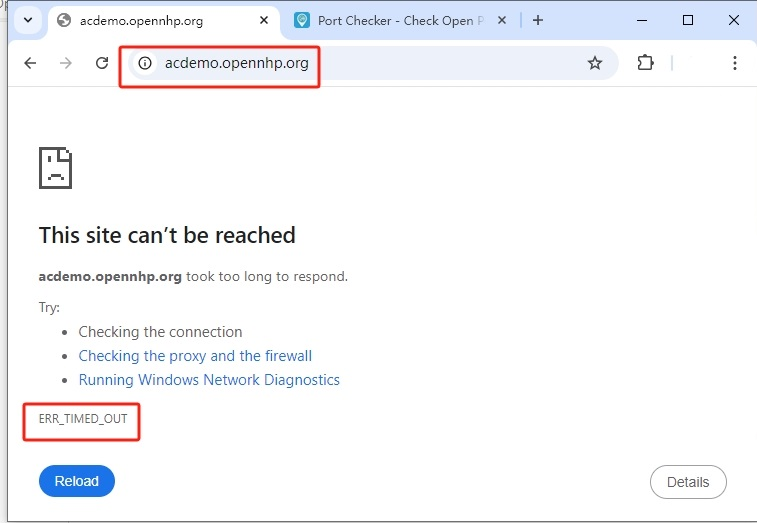
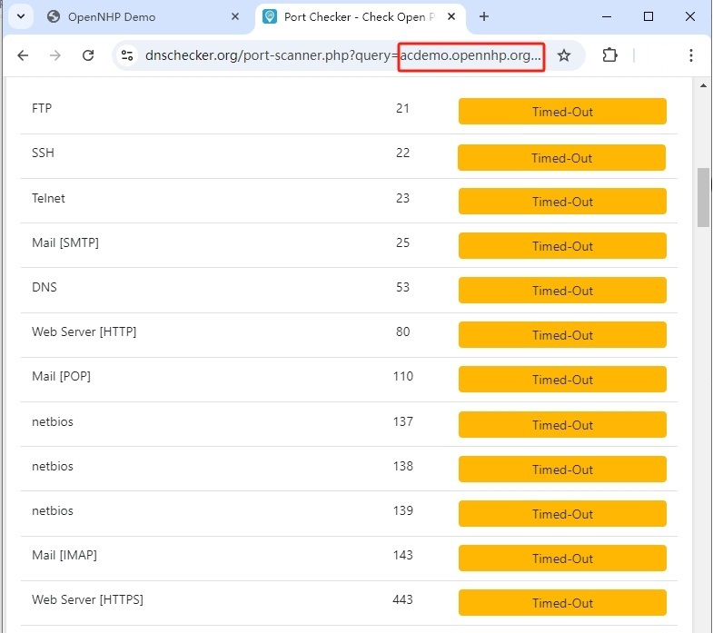
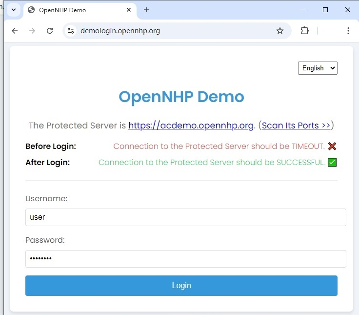
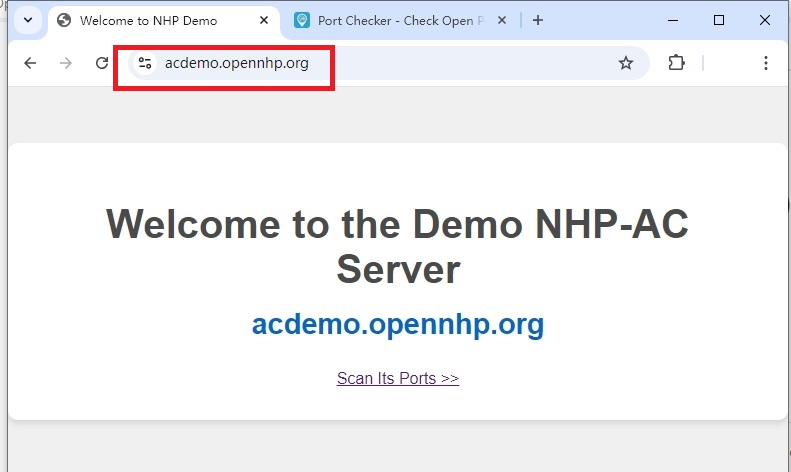
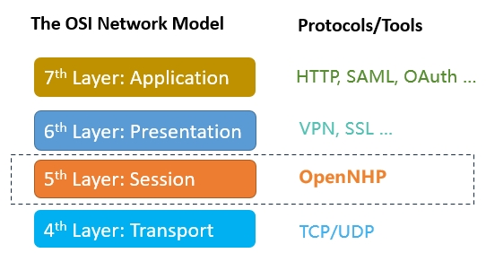

# OpenNHP: Zero Trust Netzwerk-Infrastruktur-Verbergungsprotokoll
Ein leichtgewichtiges, kryptographisch getriebenes Zero Trust Netzwerkprotokoll auf der OSI-Schicht 5, um Ihren Server und Ihre Daten vor Angreifern zu verbergen.

---

## Herausforderung: KI verwandelt das Internet in einen "Dunklen Wald"

Der schnelle Fortschritt der **KI**-Technologien, insbesondere großer Sprachmodelle (LLMs), verändert die Cybersicherheitslandschaft erheblich. Das Aufkommen der **autonomen Ausnutzung von Schwachstellen (AVE)** stellt einen großen Fortschritt im KI-Zeitalter dar, indem es die Ausnutzung von Schwachstellen automatisiert, wie in [diesem Forschungspapier](https://arxiv.org/abs/2404.08144) gezeigt wird. Diese Entwicklung erhöht das Risiko für alle exponierten Netzwerkdienste erheblich und erinnert an die [Dunkle Wald-Hypothese](https://de.wikipedia.org/wiki/Dunkler_Wald) des Internets. KI-gesteuerte Tools scannen kontinuierlich die digitale Umgebung, identifizieren schnell Schwachstellen und nutzen sie aus. Folglich entwickelt sich das Internet zu einem **"dunklen Wald"**, in dem **Sichtbarkeit Verwundbarkeit bedeutet**.

Gartner prognostiziert einen [schnellen Anstieg von KI-gesteuerten Cyberangriffen](https://www.gartner.com/en/newsroom/press-releases/2024-08-28-gartner-forecasts-global-information-security-spending-to-grow-15-percent-in-2025). Dieser Wandel erfordert eine Neubewertung traditioneller Cybersicherheitsstrategien mit einem Fokus auf proaktive Verteidigungsmaßnahmen, schnelle Reaktionsmechanismen und die Einführung von Netzwerkverbergungstechnologien zum Schutz kritischer Infrastrukturen.

---

## Schnelle Demo: OpenNHP in Aktion sehen

Bevor wir in die Details von OpenNHP eintauchen, beginnen wir mit einer kurzen Demonstration, wie OpenNHP einen Server vor unbefugtem Zugriff schützt. Sie können dies in Aktion sehen, indem Sie den geschützten Server unter https://acdemo.opennhp.org aufrufen.

### 1) Der geschützte Server ist für nicht authentifizierte Benutzer "unsichtbar"

Standardmäßig führt jeder Versuch, eine Verbindung zum geschützten Server herzustellen, zu einem TIME OUT-Fehler, da alle Ports geschlossen sind, wodurch der Server *"unsichtbar"* und scheinbar offline wird.

Das Scannen der Ports des Servers führt ebenfalls zu einem TIME OUT-Fehler.

### 2) Nach der Authentifizierung wird der geschützte Server zugänglich

OpenNHP unterstützt eine Vielzahl von Authentifizierungsmethoden, wie OAuth, SAML, QR-Codes und mehr. Für diese Demonstration verwenden wir einen einfachen Benutzernamen/Passwort-Authentifizierungsdienst unter https://demologin.opennhp.org.

Sobald Sie auf die Schaltfläche "Login" klicken, ist die Authentifizierung erfolgreich und Sie werden zum geschützten Server weitergeleitet. Zu diesem Zeitpunkt wird der Server *"sichtbar"* und auf Ihrem Gerät zugänglich.

---

## Vision: Das Internet vertrauenswürdig machen

Die Offenheit der TCP/IP-Protokolle hat das explosive Wachstum von Internetanwendungen vorangetrieben, aber auch Schwachstellen offengelegt, die es böswilligen Akteuren ermöglichen, unbefugten Zugriff zu erhalten und jede exponierte IP-Adresse auszunutzen. Obwohl das [OSI-Netzwerkmodell](https://de.wikipedia.org/wiki/OSI-Modell) die *5. Schicht (Sitzungsschicht)* zur Verwaltung von Verbindungen definiert, wurden bisher nur wenige effektive Lösungen hierfür implementiert.

**NHP**, oder das **"Netzwerk-Infrastruktur-Verbergungsprotokoll"**, ist ein leichtgewichtiges, kryptographisch getriebenes Zero Trust Netzwerkprotokoll, das auf der *OSI-Sitzungsschicht* arbeitet und sich ideal zur Verwaltung der Netzwerkvisibilität und Verbindungen eignet. Das Hauptziel von NHP ist es, geschützte Ressourcen vor unbefugten Entitäten zu verbergen und den Zugriff nur verifizierten, autorisierten Benutzern durch kontinuierliche Überprüfung zu gewähren, um so zu einem vertrauenswürdigeren Internet beizutragen.

---

## Lösung: OpenNHP stellt die Kontrolle über die Netzwerkvisibilität wieder her

**OpenNHP** ist die Open-Source-Implementierung des NHP-Protokolls. Es basiert auf der Kryptographie und wurde mit Sicherheitsprinzipien im Vordergrund entwickelt, um eine echte Zero Trust-Architektur auf der *OSI-Sitzungsschicht* zu implementieren.

OpenNHP baut auf früheren Forschungen zur Netzwerkverbergungstechnologie auf und nutzt moderne kryptographische Rahmenwerke und Architektur, um Sicherheit und hohe Leistung zu gewährleisten und die Einschränkungen früherer Technologien zu überwinden.

| Netzwerk-Infrastruktur-Verbergungsprotokoll | 1. Generation | 2. Generation | 3. Generation |
|:---|:---|:---|:---|
| **Kerntechnologie** | [Port Knocking](https://de.wikipedia.org/wiki/Port_knocking) | [Single Packet Authorization (SPA)](https://cloudsecurityalliance.org/artifacts/software-defined-perimeter-zero-trust-specification-v2) | Netzwerk-Infrastruktur-Verbergungsprotokoll (NHP) |
| **Authentifizierung** | Port-Sequenzen | Geteilte Geheimnisse | Modernes Kryptographie-Rahmenwerk |
| **Architektur** | Kein Kontrollplan | Kein Kontrollplan | Skalierbarer Kontrollplan |
| **Fähigkeit** | Ports verbergen | Ports verbergen | Ports, IPs und Domains verbergen |
| **Zugriffskontrolle** | IP-Ebene | Port-Ebene | Anwendungsebene |
| **Open-Source-Projekte** | [knock](https://github.com/jvinet/knock) *(C)* | [fwknop](https://github.com/mrash/fwknop) *(C++)* | [OpenNHP](https://github.com/OpenNHP/opennhp) *(Go)* |

> Es ist entscheidend, eine **speichersichere** Sprache wie *Go* für die Entwicklung von OpenNHP zu wählen, wie im [technischen Bericht der US-Regierung](https://www.whitehouse.gov/wp-content/uploads/2024/02/Final-ONCD-Technical-Report.pdf) betont wird. Für einen detaillierten Vergleich zwischen **SPA und NHP** lesen Sie bitte die [Abschnitt unten](#comparison-between-spa-and-nhp).

## Sicherheitsvorteile

Da OpenNHP Zero Trust-Prinzipien auf der *OSI-Sitzungsschicht* implementiert, bietet es erhebliche Vorteile:

- Reduziert die Angriffsfläche durch Verbergen der Infrastruktur
- Verhindert unbefugte Netzwerkaufklärung
- Mildert die Ausnutzung von Schwachstellen
- Verhindert Phishing durch verschlüsseltes DNS
- Schützt vor DDoS-Angriffen
- Ermöglicht granulare Zugriffskontrolle
- Bietet verbindungsbasierte Identitätsverfolgung
- Angriffszurechnung

## Architektur

Die Architektur von OpenNHP orientiert sich an der [NIST Zero Trust-Architektur](https://www.nist.gov/publications/zero-trust-architecture). Sie folgt einem modularen Design mit drei Hauptkomponenten: **NHP-Server**, **NHP-AC** und **NHP-Agent**, wie in der folgenden Abbildung dargestellt.

> Weitere Informationen zur Architektur und zum Workflow finden Sie in der [OpenNHP-Dokumentation](https://opennhp.org/).

## Kern: Kryptographische Algorithmen

Kryptographie steht im Mittelpunkt von OpenNHP und bietet robuste Sicherheit, hervorragende Leistung und Skalierbarkeit durch den Einsatz modernster kryptographischer Algorithmen. Nachfolgend sind die wichtigsten kryptographischen Algorithmen und Frameworks aufgeführt, die von OpenNHP verwendet werden:

- **[Elliptische Kurvenkryptographie (ECC)](https://de.wikipedia.org/wiki/Elliptische-Kurven-Kryptographie)**: Wird für effiziente asymmetrische Kryptographie verwendet.

> Im Vergleich zu RSA bietet ECC eine höhere Effizienz mit stärkerer Verschlüsselung bei kürzeren Schlüssellängen, was sowohl die Netzwerkübertragung als auch die Rechenleistung verbessert. Die folgende Tabelle zeigt die Unterschiede in der Sicherheitsstärke, den Schlüssellängen und dem Verhältnis zwischen RSA und ECC sowie die jeweiligen Gültigkeitszeiträume.

| Sicherheitsstärke (Bits) | DSA/RSA-Schlüssellänge (Bits) | ECC-Schlüssellänge (Bits) | Verhältnis: ECC zu DSA/RSA | Gültigkeit |
|:------------------------:|:-----------------------------:|:------------------------:|:--------------------------:|:---------:|
| 80                       | 1024                          | 160-223                  | 1:6                        | Bis 2010  |
| 112                      | 2048                          | 224-255                  | 1:9                        | Bis 2030  |
| 128                      | 3072                          | 256-383                  | 1:12                       | Nach 2031 |
| 192                      | 7680                          | 384-511                  | 1:20                       |           |
| 256                      | 15360                         | 512+                     | 1:30                       |           |

- **[Noise Protocol Framework](https://noiseprotocol.org/)**: Ermöglicht sicheren Schlüsselaustausch, Nachrichtenverschlüsselung/-entschlüsselung und gegenseitige Authentifizierung.

> Das Noise-Protokoll basiert auf dem [Diffie-Hellman-Schlüsselaustausch](https://de.wikipedia.org/wiki/Diffie-Hellman-Schl%C3%BCsselaustausch) und bietet moderne kryptographische Lösungen wie gegenseitige und optionale Authentifizierung, Identitätsverbergung, Vorwärtsgeheimnis und null Round-Trip-Verschlüsselung. Es hat sich bereits durch seine Sicherheit und Leistung bewährt und wird von beliebten Anwendungen wie [WhatsApp](https://www.whatsapp.com/security/WhatsApp-Security-Whitepaper.pdf), [Slack](https://github.com/slackhq/nebula) und [WireGuard](https://www.wireguard.com/) verwendet.

- **[Identitätsbasierte Kryptographie (IBC)](https://de.wikipedia.org/wiki/Identit%C3%A4tsbasierte_Kryptographie)**: Vereinfacht die Schlüsselverteilung im großen Maßstab.

> Eine effiziente Schlüsselverteilung ist entscheidend für die Umsetzung von Zero Trust. OpenNHP unterstützt sowohl PKI als auch IBC. Während PKI seit Jahrzehnten weit verbreitet ist, hängt es von zentralisierten Zertifizierungsstellen (CA) zur Identitätsprüfung und Schlüsselverwaltung ab, was zeitaufwändig und kostspielig sein kann. Im Gegensatz dazu ermöglicht IBC einen dezentralisierten und selbstverwalteten Ansatz für die Identitätsprüfung und Schlüsselverwaltung, was es kostengünstiger für die Zero Trust-Umgebung von OpenNHP macht, in der Milliarden von Geräten oder Servern in Echtzeit geschützt und eingebunden werden müssen.

- **[Zertifikatslose Kryptographie (CL-PKC)](https://de.wikipedia.org/wiki/Zertifikatslose_Kryptographie)**: Empfohlener IBC-Algorithmus

> CL-PKC ist ein Schema, das die Sicherheit verbessert, indem es die Schlüsselverwaltung vermeidet und die Einschränkungen der identitätsbasierten Kryptographie (IBC) angeht. In den meisten IBC-Systemen wird der private Schlüssel eines Benutzers von einer Schlüsselgenerierungsstelle (KGC) erstellt, was erhebliche Risiken birgt. Ein kompromittierter KGC kann zur Offenlegung der privaten Schlüssel aller Benutzer führen, wodurch volles Vertrauen in den KGC erforderlich ist. CL-PKC mindert dieses Problem, indem der Schlüsselerstellungsprozess aufgeteilt wird, sodass der KGC nur einen Teil des privaten Schlüssels kennt. Dadurch kombiniert CL-PKC die Stärken von PKI und IBC und bietet eine stärkere Sicherheit ohne die Nachteile der zentralisierten Schlüsselverwaltung.

Weiterführende Informationen:

> Weitere Details zu den in OpenNHP verwendeten kryptographischen Algorithmen finden Sie in der [OpenNHP-Dokumentation](https://opennhp.org/cryptography/).

## Hauptfunktionen

- Mildert die Ausnutzung von Schwachstellen, indem standardmäßig "deny-all"-Regeln angewendet werden
- Verhindert Phishing-Angriffe durch verschlüsselte DNS-Auflösung
- Schützt vor DDoS-Angriffen, indem die Infrastruktur verborgen wird
- Ermöglicht Angriffszurechnung durch identitätsbasierte Verbindungen
- Standardmäßig verweigerter Zugriff auf alle geschützten Ressourcen
- Authentifizierung basierend auf Identität und Geräten vor dem Netzwerkzugang
- Verschlüsselte DNS-Auflösung, um DNS-Hijacking zu verhindern
- Verteilte Infrastruktur zur Minderung von DDoS-Angriffen
- Skalierbare Architektur mit entkoppelten Komponenten
- Integration mit bestehenden Systemen zur Verwaltung von Identitäten und Zugriffen
- Unterstützung für verschiedene Bereitstellungsmodelle (Client-zu-Gateway, Client-zu-Server usw.)
- Kryptographisch sicher unter Verwendung moderner Algorithmen (ECC, Noise Protocol, IBC)

Klicken Sie hier, um die Funktionsdetails zu erweitern

- **Standardmäßig verweigerter Zugriff**: Alle Ressourcen sind standardmäßig verborgen und werden nur nach Authentifizierung und Autorisierung zugänglich.
- **Authentifizierung basierend auf Identität und Geräten**: Stellt sicher, dass nur bekannte Benutzer auf zugelassenen Geräten Zugriff erhalten.
- **Verschlüsselte DNS-Auflösung**: Verhindert DNS-Hijacking und damit verbundene Phishing-Angriffe.
- **DDoS-Minderung**: Das verteilte Infrastruktursystem hilft beim Schutz vor DDoS-Angriffen.
- **Skalierbare Architektur**: Entkoppelte Komponenten ermöglichen flexiblen Einsatz und Skalierung.
- **IAM-Integration**: Funktioniert mit Ihren bestehenden Systemen zur Verwaltung von Identitäten und Zugriffen.
- **Flexibler Einsatz**: Unterstützt verschiedene Modelle, einschließlich Client-zu-Gateway, Client-zu-Server und mehr.
- **Starke Kryptographie**: Nutzt moderne Algorithmen wie ECC, Noise Protocol und IBC für robuste Sicherheit.

## Bereitstellung

OpenNHP unterstützt mehrere Bereitstellungsmodelle für unterschiedliche Anwendungsfälle:

- Client-zu-Gateway: Sichert den Zugriff auf mehrere Server hinter einem Gateway
- Client-zu-Server: Sichert direkt einzelne Server/Anwendungen
- Server-zu-Server: Sichert die Kommunikation zwischen Backend-Diensten
- Gateway-zu-Gateway: Sichert Standort-zu-Standort-Verbindungen

> Weitere Details zur Bereitstellung finden Sie in der [OpenNHP-Dokumentation](https://opennhp.org/deploy/).

## Vergleich zwischen SPA und NHP
Das Single Packet Authorization (SPA)-Protokoll ist in der vom [Cloud Security Alliance (CSA)](https://cloudsecurityalliance.org/) veröffentlichten [Software Defined Perimeter (SDP)-Spezifikation](https://cloudsecurityalliance.org/artifacts/software-defined-perimeter-zero-trust-specification-v2) enthalten. NHP verbessert die Sicherheit, Zuverlässigkeit, Skalierbarkeit und Erweiterbarkeit durch ein modernes kryptographisches Framework und eine moderne Architektur, wie im [AHAC-Forschungspapier](https://www.mdpi.com/2076-3417/14/13/5593) gezeigt.

| - | SPA | NHP | Vorteile von NHP |
|:---|:---|:---|:---|
| **Architektur** | Das SPA-Paketentschlüsselungs- und Benutzer-/Geräteauthentifizierungskomponente ist mit der Netzwerkzugriffskontrollkomponente im SPA-Server gekoppelt. | NHP-Server (die Paketentschlüsselungs- und Benutzer-/Geräteauthentifizierungskomponente) und NHP-AC (die Zugriffskontrollkomponente) sind entkoppelt. Der NHP-Server kann auf separaten Hosts bereitgestellt werden und unterstützt horizontale Skalierung. | <ul><li>Performance: Die ressourcenintensive Komponente NHP-Server ist vom geschützten Server getrennt.</li><li>Skalierbarkeit: Der NHP-Server kann im verteilten oder Cluster-Modus bereitgestellt werden.</li><li>Sicherheit: Die IP-Adresse des geschützten Servers ist für den Client nicht sichtbar, solange die Authentifizierung nicht erfolgreich war.</li></ul>|
| **Kommunikation** | Einfache Richtung | Bidirektional | Bessere Zuverlässigkeit durch Statusbenachrichtigung der Zugriffskontrolle |
| **Kryptographisches Framework** | Geteilte Geheimnisse | PKI oder IBC, Noise Framework | <ul><li>Sicherheit: Bewährter Schlüsselvereinbarungsmechanismus zur Abschwächung von MITM-Bedrohungen</li><li>Niedrige Kosten: Effiziente Schlüsselverteilung für das Zero Trust-Modell</li><li>Performance: Hochleistungs-Verschlüsselung/Entschlüsselung</li></ul>|
| **Fähigkeit zur Verbergung der Netzwerkinfrastruktur** | Nur Serverports | Domains, IPs und Ports | Stärker gegen verschiedene Angriffe (z.B. Schwachstellen, DNS-Hijacking und DDoS-Angriffe) |
| **Erweiterbarkeit** | Keine, nur für SDP | Universell | Unterstützt jedes Szenario, das eine Dienstverschleierung erfordert |
| **Interoperabilität** | Nicht verfügbar | Anpassbar | NHP kann nahtlos mit bestehenden Protokollen (z.B. DNS, FIDO usw.) integriert werden |

## Beitrag leisten

Wir begrüßen Beiträge zu OpenNHP! Bitte lesen Sie unsere [Beitragsrichtlinien](CONTRIBUTING.md), um mehr darüber zu erfahren, wie Sie sich beteiligen können.

## Lizenz

OpenNHP wird unter der [Apache 2.0-Lizenz](LICENSE) veröffentlicht.

## Kontakt

- Projekt-Website: [https://github.com/OpenNHP/opennhp](https://github.com/OpenNHP/opennhp)
- E-Mail: [opennhp@gmail.com](mailto:opennhp@gmail.com)
- Slack-Kanal: [Treten Sie unserem Slack bei](https://slack.opennhp.org)

Für eine detaillierte Dokumentation besuchen Sie bitte unsere [Offizielle Dokumentation](https://opennhp.org).

## Referenzen

- [Software-Defined Perimeter (SDP) Specification v2.0](https://cloudsecurityalliance.org/artifacts/software-defined-perimeter-zero-trust-specification-v2). Jason Garbis, Juanita Koilpillai, Junaid lslam, Bob Flores, Daniel Bailey, Benfeng Chen, Eitan Bremler, Michael Roza, Ahmed Refaey Hussein. [*Cloud Security Alliance (CSA)*](https://cloudsecurityalliance.org/). März 2022.
- [AHAC: Fortschrittliches Netzwerk-Verbergung-Zugriffskontroll-Framework](https://www.mdpi.com/2076-3417/14/13/5593). Mudi Xu, Benfeng Chen, Zhizhong Tan, Shan Chen, Lei Wang, Yan Liu, Tai Io San, Sou Wang Fong, Wenyong Wang und Jing Feng. *Zeitschrift für Angewandte Wissenschaften*. Juni 2024.
- [STALE: Ein skalierbares und sicheres grenzüberschreitendes Authentifizierungssystem, das E-Mail und ECDH-Schlüsselaustausch nutzt](https://www.mdpi.com/2079-9292/14/12/2399) Jiexin Zheng, Mudi Xu, Jianqing Li, Benfeng Chen, Zhizhong Tan, Anyu Wang, Shuo Zhang, Yan Liu, Kevin Qi Zhang, Lirong Zheng, and Wenyong Wang. *Elektronik*. Juni 2025
- Noise Protocol Framework. https://noiseprotocol.org/
- Vulnerability Management Framework-Projekt. https://phoenix.security/web-vuln-management/

---

🌟 Vielen Dank für Ihr Interesse an OpenNHP! Wir freuen uns auf Ihre Beiträge und Ihr Feedback.

