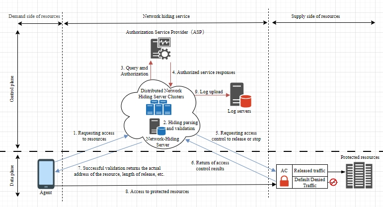

# OpenNHP Documentation
{: .fs-9 }

 OpenNHP implements the Zero Trust communication protocol NHP.
{: .fs-6 .fw-300 }

[中文版](./zh-cn/){: .label .fs-4 }

---

## 1. OpenNHP Architecture

The OpenNHP architecture is inspired by the NIST Zero Trust Architecture standard. It follows a modular design with the following core components: 

### 2. OpenNHP Core Components:
#### 2.1 NHP-Agent

The NHP-Agent is a client-side component that initiates communication and requests access to protected resources. It can be implemented as:

- A standalone client application
- An SDK integrated into existing applications
- A browser plugin
- A mobile app

The agent is responsible for:

- Generating and sending knock requests to the NHP-Server
- Maintaining secure communication channels
- Handling authentication flows

#### 2.2 NHP-Server

The NHP-Server is the central controller that:

- Processes and validates knock requests from agents
- Interacts with the Authorization Service Provider for policy decisions
- Manages NHP-AC components to allow/deny access
- Handles key management and cryptographic operations

It can be deployed in a distributed or clustered configuration for high availability and scalability.

#### 2.3 NHP-AC

NHP-AC (Access Control) components enforce access policies on protected resources. Key functions:

- Implement default deny-all rules
- Open/close access based on NHP-Server instructions
- Ensure network invisibility of protected resources
- Log access attempts

### 3. Components that interact with OpenNHP: 
- **Protected Resources:** The resource provider is responsible for protecting these resources, such as API interfaces, application servers, gateways, routers, network devices, etc. In the SDP scenario, the Protected Resources are the SDP Gateway and Controller. 
- **Authorization Service Provider (ASP):** This provider validates access policies and provides the actual access addresses of Protected Resources. In the SDP Scenario, the ASP may be the SDP Controller. 

### 4. Workflow

The workflow of OpenNHP is illustrated as the below diagram. 

1. `NHP-Agent` sends knock request to `NHP-Server`
2. `NHP-Server` validates request and retrieves agent info
3. `NHP-Server` queries Authorization Service Provider
4. If authorized, `NHP-Server` instructs `NHP-AC` to allow access
5. `NHP-AC` opens connection and notifies `NHP-Server`
6. `NHP-Server` provides resource access details to `NHP-Agent`
7. `NHP-Agent` can now access the protected resource
8. Access is logged for auditing purposes
